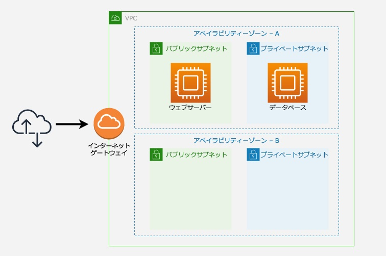

# AWS_CLI
## Task 1


ターミナルに"envsubst" パッケージをインストール。シェルフォーマットの文字列をテキストの環境変数で置き換えるもの
```
sudo yum install gettext -y
```
インストールされている場合
```
Loaded plugins: extras_suggestions, langpacks, priorities, update-motd
Package gettext-0.19.8.1-3.amzn2.x86_64 already installed and latest version
Nothing to do
```
AWS アカウント番号を環境変数として設定します。
```
export awsAccount=`aws sts get-caller-identity --query "Account" --output text` && echo awsAccount=$awsAccount >> ~/.bashrc
```
インスタンスメタデータをクエリし、Amazon EC2 インスタンスの AWS リージョンを環境変数として設定します。
```
export awsRegion=`curl -s http://169.254.169.254/latest/meta-data/placement/region` && echo awsRegion=$awsRegion >> ~/.bashrc
```
仮想プライベートクラウド (VPC) ID を環境変数として設定します。
```
export VPC=`aws ec2 describe-vpcs --filters Name=tag:Name,Values=wa-lab-vpc --query 'Vpcs[*].VpcId' --output text --region $awsRegion` && echo VPC=$VPC >> ~/.bashrc
```
AWS リージョンの最初のアベイラビリティーゾーンのIDを環境変数を設定します。
```
export awsAZ1=`aws ec2 describe-availability-zones --region $awsRegion --query 'AvailabilityZones[].ZoneName[]|[0]' --output text` && echo awsAZ1=$awsAZ1 >> ~/.bashrc
```
AWS リージョンの 2 つ目のアベイラビリティーゾーンの環境変数を設定します。
```
export awsAZ2=`aws ec2 describe-availability-zones --region $awsRegion --query 'AvailabilityZones[].ZoneName[]|[1]' --output text` && echo awsAZ2=$awsAZ2 >> ~/.bashrc
```
2 つ目のアベイラビリティーゾーンにパブリックサブネットを作成します。
```
aws ec2 create-subnet --vpc-id $VPC --cidr-block "10.100.2.0/24" --availability-zone $awsAZ2 --tag-specifications 'ResourceType=subnet, Tags=[{Key=Name,Value=wa-public-subnet-2}]' --region $awsRegion
```
出力
```
{
    "Subnet": {
        "MapPublicIpOnLaunch": false,
        "AvailabilityZoneId": "use1-az6",
        "Tags": [
            {
                "Value": "wa-public-subnet-2",
                "Key": "Name"
            }
        ],
        "AvailableIpAddressCount": 251,
        "DefaultForAz": false,
        "SubnetArn": "arn:aws:ec2:us-east-1:238827011620:subnet/subnet-0f191ca93f95b8082",
        "Ipv6CidrBlockAssociationSet": [],
        "VpcId": "vpc-0a296354b51520c5d",
        "State": "available",
        "AvailabilityZone": "us-east-1b",
        "SubnetId": "subnet-0f191ca93f95b8082",
        "OwnerId": "238827011620",
        "CidrBlock": "10.100.2.0/24",
        "AssignIpv6AddressOnCreation": false
    }
}
```
2 つ目のアベイラビリティーゾーンにプライベートサブネットを作成します。
```
aws ec2 create-subnet --vpc-id $VPC --cidr-block "10.100.3.0/24" --availability-zone $awsAZ2 --tag-specifications 'ResourceType=subnet, Tags=[{Key=Name,Value=wa-private-subnet-2}]' --region $awsRegion
```
出力
```
{
    "Subnet": {
        "MapPublicIpOnLaunch": false,
        "AvailabilityZoneId": "use1-az6",
        "Tags": [
            {
                "Value": "wa-private-subnet-2",
                "Key": "Name"
            }
        ],
        "AvailableIpAddressCount": 251,
        "DefaultForAz": false,
        "SubnetArn": "arn:aws:ec2:us-east-1:238827011620:subnet/subnet-05dced5e4b32261dd",
        "Ipv6CidrBlockAssociationSet": [],
        "VpcId": "vpc-0a296354b51520c5d",
        "State": "available",
        "AvailabilityZone": "us-east-1b",
        "SubnetId": "subnet-05dced5e4b32261dd",
        "OwnerId": "238827011620",
        "CidrBlock": "10.100.3.0/24",
        "AssignIpv6AddressOnCreation": false
    }
}
```
新しいパブリックサブネットを環境変数として追加します。
```
export publicSubnetId=`aws ec2 describe-subnets --filters Name=tag:Name,Values=wa-public-subnet-2 --query 'Subnets[*].SubnetId' --output text --region $awsRegion` && echo publicSubnetId=$publicSubnetId >> ~/.bashrc
```
新しいプライベートサブネットを環境変数として追加します。
```
export privateSubnetId=`aws ec2 describe-subnets --filters Name=tag:Name,Values=wa-private-subnet-2 --query 'Subnets[*].SubnetId' --output text --region $awsRegion` && echo privateSubnetId=$privateSubnetId >> ~/.bashrc
```
既存のパブリックルートテーブルを環境変数として追加します。
```
export publicRt=`aws ec2 describe-route-tables --filters Name=tag:Name,Values=wa-public-rt --query 'RouteTables[*].RouteTableId' --output text --region $awsRegion` && echo publicRt=$publicRt >> ~/.bashrc
```
既存のプライベートルートテーブルを環境変数として追加します。
```
export privateRt=`aws ec2 describe-route-tables --filters Name=tag:Name,Values=wa-private-rt --query 'RouteTables[*].RouteTableId' --output text --region $awsRegion` && echo privateRt=$privateRt >> ~/.bashrc
```
2 つ目のアベイラビリティーゾーンで作成されたパブリックサブネットを含む既存のパブリックルートテーブルに関連付ける。
```
aws ec2 associate-route-table --subnet-id $publicSubnetId --route-table-id $publicRt --region $awsRegion
```
出力
```
{
    "AssociationState": {
        "State": "associated"
    },
    "AssociationId": "rtbassoc-0754972f40549eba1"
}
```
2 つ目のアベイラビリティーゾーンで作成されたプライベートサブネットを含む既存のプライベートルートテーブルに関連付ける。
```
aws ec2 associate-route-table --subnet-id $privateSubnetId --route-table-id $privateRt --region $awsRegion
```
出力
```
{
    "AssociationState": {
        "State": "associated"
    },
    "AssociationId": "rtbassoc-0ef7937d44b5f94ee"
}
```
